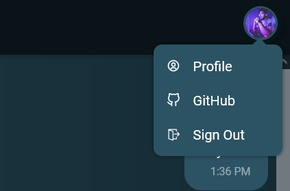

# React realtime chat application using Firebase and Cloud Firestore

## Website

https://react-firebase-chat-9f5b1.web.app/

## Tech Stack

## Google OAuth

## Realtime chat

## Notifications

## Profile

